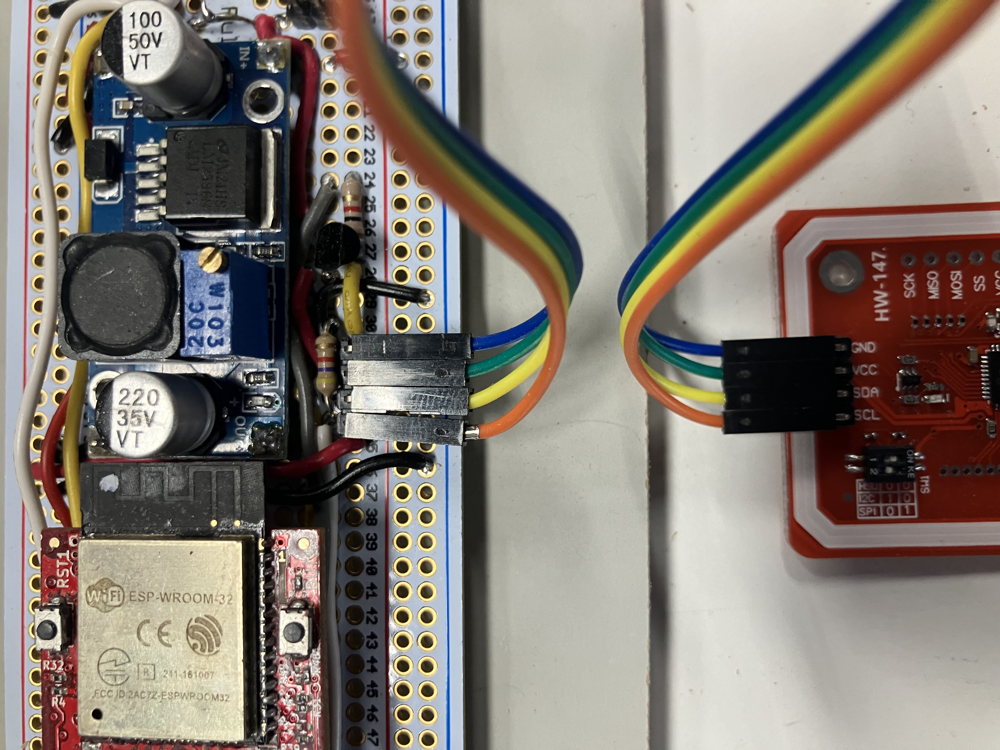
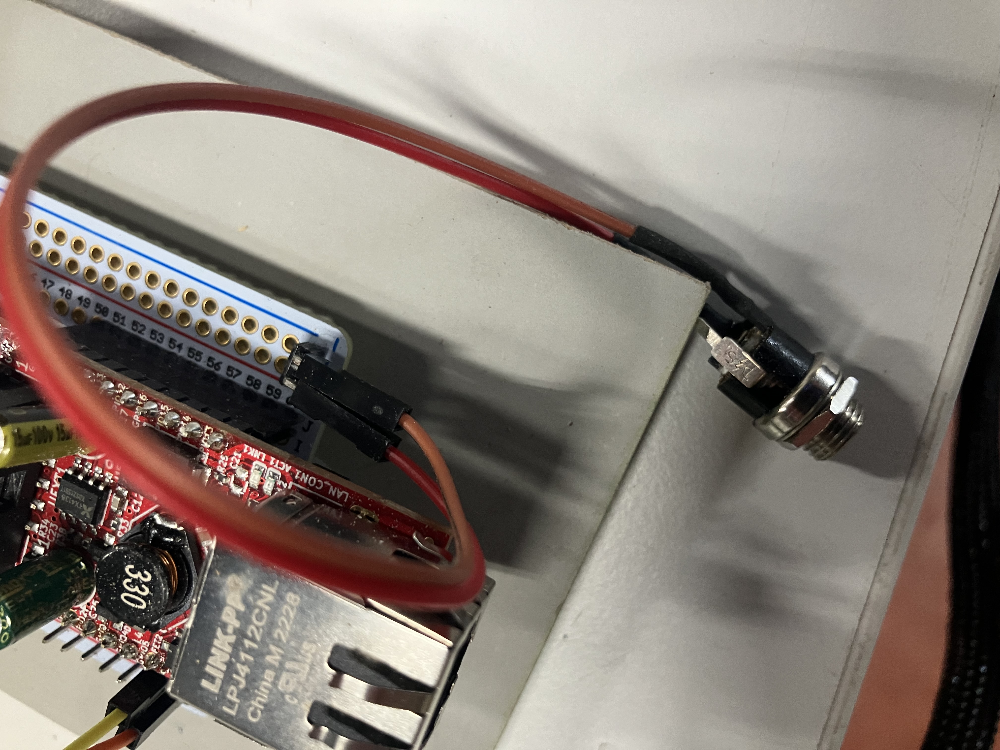
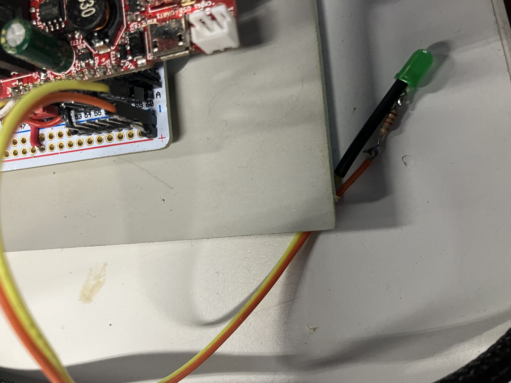
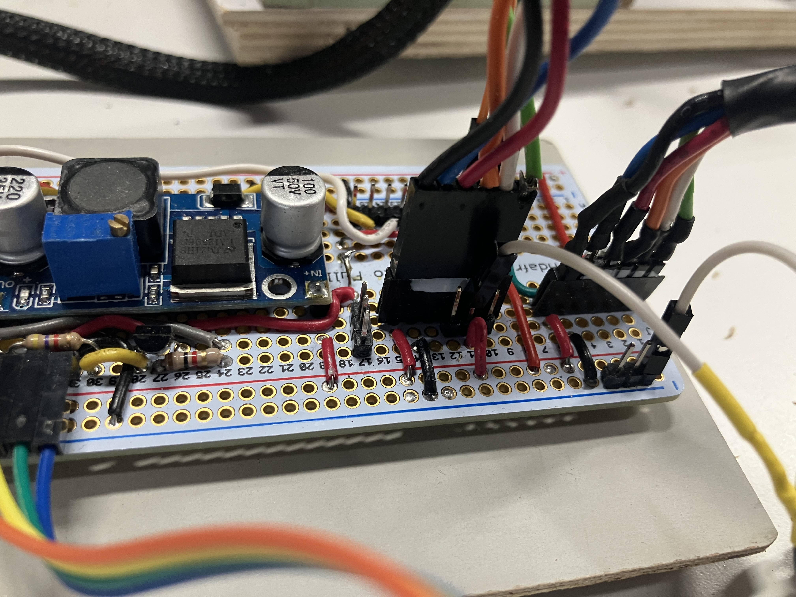
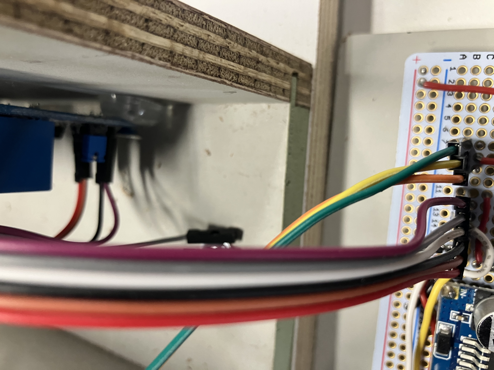
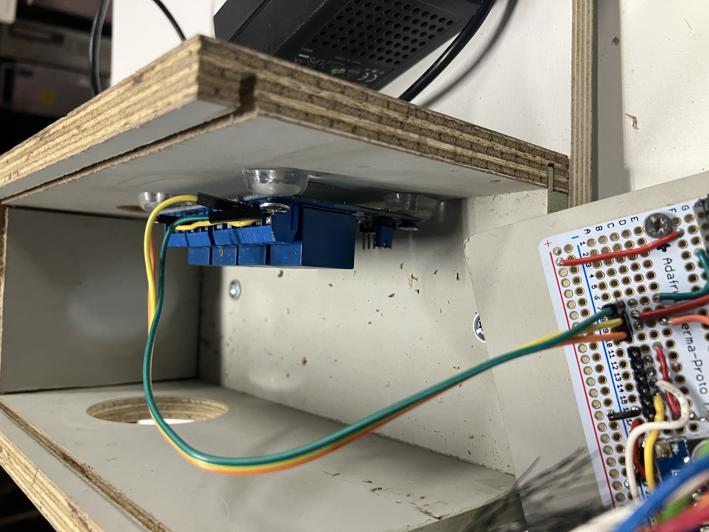
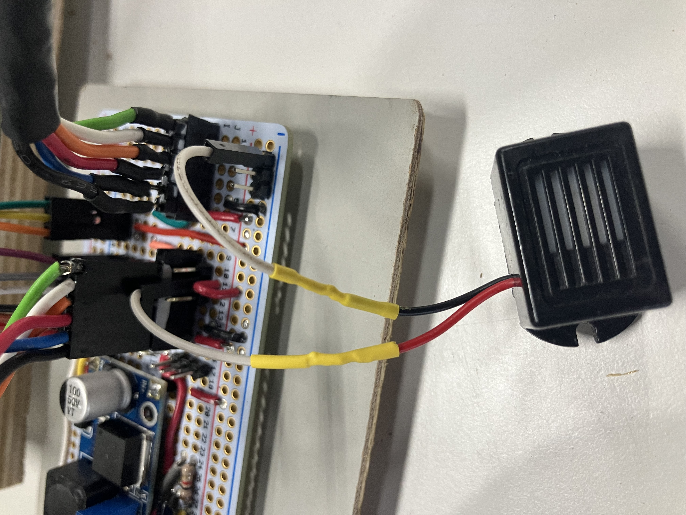

# RFID Module

- orange = SCL
- yellow = SDA
- green = 3.3V
- blue = GND
 

# Power

- red = 12V (barrel tip)
- brown = GND 

# LED

- orange = GND
- yellow = GPIO05 = ESP pin 10

# Locks

- black = PWR (12V)
- blue = GND
- red = SIG
- orange = NO
- white = COM
- green = NC

# Relay in

Watch out! Not one-to-one (as relay  #2 is broken)

- red = GND
- brown = IN relay #1
- black = IN relay #4 
- white = not connected
- gray = not connected
- red = 3.3V

# Relay out

- orange = SIG lock #1
- yellow = 12v
- green = SIG lock #2 

# Buzzer

- gray = relay #1 NO 
- white = GND

